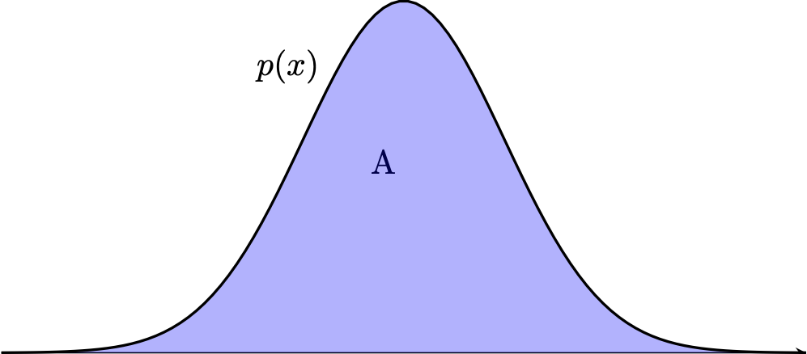

#+TITLE: Lossy data compression with stochastic codes and their characterisation via the functional information
#+author: Gergely Flamich
#+date: 06/07/2026

#+REVEAL_ROOT: https://cdn.jsdelivr.net/npm/reveal.js
# This is needed to make the speaker notes work
#+REVEAL_REVEAL_JS_VERSION: 4
#+OPTIONS: reveal_title_slide:"<h2>%t</h2><h2>%s</h2> <h4>%a</h4><h4>%d</h4><h6><a href='https://arxiv.org/abs/2604.23076'>paper now available on Arxiv!</a></h6>"
#+OPTIONS: toc:nil
#+OPTIONS: num:nil
#+REVEAL_THEME: white
#+REVEAL_INIT_OPTIONS: slideNumber:'c/t', transition:'none'
#+REVEAL_HLEVEL:0
#+REVEAL_MATHJAX_URL: https://cdn.jsdelivr.net/npm/mathjax@3/es5/tex-mml-chtml.js
#+REVEAL_EXTRA_CSS: ./presentation_styles.css

* In Collaboration With

#+REVEAL_HTML: 
#+REVEAL_HTML: 
#+REVEAL_HTML: 

# Characterising the minimum number of bits required to encode data is a central aim of information theory.
# Yet, despite some steady progress in recent years, the field still lacks tight non-asymptotic results in general.
#
# In this talk, I will partially address this matter by exhibiting several tight, one-shot bounds for lossy data compression,
# using a newly proposed information measure which we call the functional information.
# I will begin the talk by introducing stochastic codes and discussing some of their theory and applications.
# Then, I will introduce the functional information, establish some of its basic properties,
# and relate it to mutual information and Shannon entropy.
#
# I will follow up by characterising the minimum achievable rate of stochastic codes using the functional information.
# Finally, I will close by illustrating some applications of this characterisation to one-shot rate-distortion theory and discussing some open problems.

* what is a stochastic code?
** lossless compression
#+ATTR_REVEAL: :frag (appear)
 - Source: $X \sim P_X$
 - Code: $C(x) \in \{0, 1\}^*$
 - Decode: $$ C^{-1}(C(x)) = x $$
 - Measure of efficiency: $\mathbb{E}[\vert C(X) \vert]$
 - *Entropy code:*
   $$\mathbb{E}[\vert C(X) \vert] = \mathbb{H}[P_X] + \mathcal{O}(1)$$

** stochastic codes

#+ATTR_REVEAL: :frag (appear)
 - Source: $X \sim P_X$
 - Perturbation: $P_{Y \mid X = x}$
 - Shared randomness: $Z \sim P_Z$
 - Code: $C(x, z) \in \{0, 1\}^*$
 - Decode: $$ D(C(x, Z), Z) \sim P_{Y \mid X = x}$$

** common randomness in practice
#+ATTR_REVEAL: :frag (appear)
[[./img/common_randomness_meme.jpg]]

** a general stochastic code: rejection sampling
[[./img/theory/gprs_motivation_illustration.png]]

#+ATTR_REVEAL: :frag (appear)
Fact: $(x, y) \sim \mathrm{Unif}(A) \, \Rightarrow\, x \sim P$

** a general stochastic code: rejection sampling
#+ATTR_REVEAL: :frag (appear)
[[./img/stoch_code_sketch.png]]

#+ATTR_REVEAL: :frag (appear)
\begin{gather*}
Y_n \sim P_Y, \quad U_n \sim \mathrm{Unif}(0, 1) \\
N(x) = \min\left\{n \in \mathbb{N} \mid U_n \cdot M(x) < \frac{dP_{Y \mid X=x}}{dP_Y}(Y_n) \right\}
\end{gather*}

** the objective
#+ATTR_REVEAL: :frag (appear)
\begin{align*}
R^* &= \inf_{(Z, C, D)} \mathbb{E}[|C(X, Z)|] \\
&\quad\text{s.t. } D(C(x, Z), Z) \sim P_{Y \mid X = x}
\end{align*}

** bounds
#+ATTR_REVEAL: :frag (appear)
Li and El Gamal: letting $I = I[X; Y]$,
#+ATTR_REVEAL: :frag (appear)
$$
I \leq R^* \leq I + \log(I + 1) + 4
$$
#+ATTR_REVEAL: :frag (appear)
*Main result in this talk:*
#+ATTR_REVEAL: :frag (appear)
${\color{red} F(X \to Y)}$ - functional information, then:
$$
F(X \to Y) \leq R^* \leq F(X \to Y) + 2.45
$$

* why care?
** learned transform coding
#+ATTR_REVEAL: :frag (appear)
[[./img/transform_coding.png]]
#+ATTR_REVEAL: :frag (appear)
Pick $f(x) + \epsilon$: reparameterisation trick!

** compressing differentially privacy mechanisms
#+ATTR_REVEAL: :frag (appear)
Privacy mechanism $Y \mid X = x$
#+ATTR_REVEAL: :frag (appear)
#+REVEAL_HTML: 

* the functional information
** The width function
#+ATTR_REVEAL: :frag (appear)
$Q \ll P$ with $r = dQ/dP$
#+ATTR_REVEAL: :frag (appear)
$w(h) = P(r \geq h)$
#+ATTR_REVEAL: :frag (appear)
[[./img/theory/width_fn.png]]

** representing divergences
#+ATTR_REVEAL: :frag (appear)
$w$ is a PDF! Hence, let $H \sim w$.
#+ATTR_REVEAL: :frag (appear)
\begin{align*}
\mathbb{E}[\log H]
&= D_{KL}[Q || P] - \log e \\
\mathbb{E}[H^{s - 1}]
&= \frac{1}{s}2^{(s - 1) \cdot D_{s}[Q || P] } \\
\mathbb{P}[H \geq \gamma]
&= E_\gamma[Q || P]
\end{align*}
#+ATTR_REVEAL: :frag (appear)
What about $h[H]$?

** channel simulation divergence
#+ATTR_REVEAL: :frag (appear)
$$
D_{CS}[Q || P] \triangleq h[H]
$$
#+ATTR_REVEAL: :frag (appear)
*Some properties:*
#+ATTR_REVEAL: :frag (appear)
- non-negative
- $D_{CS}[Q || P] = 0$ iff $Q = P$
- DPI
- jointly convex in $(Q, P)$

** more csd properties
#+ATTR_REVEAL: :frag (appear)
$\mathrm{KL} = D_{KL}[Q || P]$ and $\mathrm{CS} = D_{CS}[Q || P]$:
#+ATTR_REVEAL: :frag (appear)
\begin{align*}
\mathrm{KL}
\leq \mathrm{CS} &\leq \mathrm{KL} + \log(\mathrm{KL} + 1) + 1 \\
\mathrm{CS} &\leq D_{\infty}[Q || P]
\end{align*}

#+ATTR_REVEAL: :frag (appear)
Furthermore:
#+ATTR_REVEAL: :frag (appear)
$\mathrm{TV}[Q || P] \leq 1 - 2^{D_{CS}[Q || P]}$

#+ATTR_REVEAL: :frag (appear)
$\Lambda(X) = \log |\mathcal{X}| - D_{CS}[P_X || \mathrm{Unif}(\mathcal{X})]$

** functional information
#+ATTR_REVEAL: :frag (appear)
Analogy with MI for $P_{X, Y}$:
#+ATTR_REVEAL: :frag (appear)
\begin{align*}
I[X; Y]
&= D_{KL}[P_{X, Y} || P_X P_Y] \\
&= \mathbb{E}_X [D_{KL}[P_{Y \mid X} || P_Y]] \\
&= \mathbb{E}_Y [D_{KL}[P_{X \mid Y} || P_X]]
\end{align*}
#+ATTR_REVEAL: :frag (appear)
"Correct" definition:
#+ATTR_REVEAL: :frag (appear)
$$
F[X \to Y] \triangleq \mathbb{E}_Y [D_{CS}[P_{X \mid Y} || P_X]]
$$

** FI properties
$F[X \to Y] \triangleq \mathbb{E}_Y [D_{CS}[P_{X \mid Y} || P_X]]$

#+ATTR_REVEAL: :frag (appear)
Then:
#+ATTR_REVEAL: :frag (appear)
- $F[X \to X] = H[X]$ for $X$ discrete
- $F[X \to Y] = 0$ iff $X \perp Y$
- $F[X \to Y] = I[X; Y]$ iff $X \to Y$ singular
- concave in $P_X$, convex in $P_{Y \mid X}$

#+ATTR_REVEAL: :frag (appear)
$$F[X \to (Y, Z)] = F[X \to Y] + F[X \to Z \mid Y] + \Theta(1)$$

** main result
#+ATTR_REVEAL: :frag (appear)
\begin{align*}
R^* &= \inf_{(Z, C, D)} \mathbb{E}[|C(X, Z)|] \\
&\quad\text{s.t. } D(C(x, Z), Z) \sim P_{Y \mid X = x}
\end{align*}

#+ATTR_REVEAL: :frag (appear)
Then, under mild assumptions
#+ATTR_REVEAL: :frag (appear)
$$
F(X \to Y) \leq R^* \leq F(X \to Y) + 2.45
$$

#+REVEAL_HTML: 

* achievability via the ring toss code

** a general stochastic code: rejection sampling

#+ATTR_REVEAL: :frag (appear)
Fact: $(x, y) \sim \mathrm{Unif}(A) \, \Rightarrow\, x \sim P$

** a general stochastic code: rejection sampling
#+ATTR_REVEAL: :frag (appear)
[[./img/stoch_code_sketch.png]]

#+ATTR_REVEAL: :frag (appear)
\begin{gather*}
Y_n \sim P_Y, \quad U_n \sim \mathrm{Unif}(0, 1) \\
N(x) = \min\left\{n \in \mathbb{N} \mid U_n \cdot M < \frac{dP_{Y \mid X=x}}{dP_Y}(Y_n) \right\}
\end{gather*}

** encoding the index
#+ATTR_REVEAL: :frag (appear)
$N(x) \sim \mathrm{Geom}(1/M)$

#+ATTR_REVEAL: :frag (appear)
*but:* we haven't used the common randomness!

#+ATTR_REVEAL: :frag (appear)
put $w_y(h) = P_X(dP_{X \mid Y = y}/dP_X \geq h)$

#+ATTR_REVEAL: :frag (appear)
$$
Q_{N \mid Z}(n \mid z) \triangleq w_{y_k}(M u_k) \prod_{i=1}^{n-1} (1 - w_{y_i}(M u_i))
$$

** interpretation
#+ATTR_REVEAL: :frag (appear)
$\frac{dP_{X \mid Y}}{dP_X}(x \mid y) = \frac{dP_{Y \mid X}}{dP_Y}(y \mid x) \geq M u$
#+ATTR_REVEAL: :frag (appear)
RS acceptance criterion!

#+ATTR_REVEAL: :frag (appear)
$w_y(M u) = P_X\left(\frac{dP_{X \mid Y = y}}{dP_X} \geq M u\right)$
#+ATTR_REVEAL: :frag (appear)
probability that $(y, u)$ acceptanced!

** for singular channels
$X \to Y$ singular: $\frac{dP_{Y \mid X}}{dP_Y}(y \mid x) = g(y)\mathbb{1}[x \in A_y]$

#+REVEAL_HTML: 

** corollaries
$$
F(X \to Y) \leq R^* \leq F(X \to Y) + 2.45
$$
#+ATTR_REVEAL: :frag (appear)
Tighter MI bound:
#+ATTR_REVEAL: :frag (appear)
$I(X; Y) \leq R^* \leq I(X; Y) + \log(I(X; Y) + 1) + 3.45$
#+ATTR_REVEAL: :frag (appear)
Recover asymptotic behaviour:
#+ATTR_REVEAL: :frag (appear)
$\lim_{n \to \infty}\frac{F(X^n \to Y^n) - I[X^n; Y^n]}{\log n} = \begin{cases} 0 & \text{if } X \to Y \text{ singular}\\ 1/2 & \text{o.w.} \end{cases}$

* application: rate-distortion

** the objective
#+ATTR_REVEAL: :frag (appear)
One-shot rate-distortion function:
#+ATTR_REVEAL: :frag (appear)
\begin{align*}
R_O(\delta) &= \inf_{(C, D)} \mathbb{E}[|C(X)|] \\
&\quad \text{s.t. } \mathbb{E}[\Delta(X, D(C(X)))] \leq \delta
\end{align*}

** applying the FI
#+ATTR_REVEAL: :frag (appear)
Functional rate-distortion function
#+ATTR_REVEAL: :frag (appear)
\begin{align*}
R_F(\delta) &= \inf_{P_{Y \mid X}} F[X \to Y] \\
&\quad \text{s.t. } \mathbb{E}[\Delta(X, Y)] \leq \delta
\end{align*}

#+ATTR_REVEAL: :frag (appear)
Then:
#+ATTR_REVEAL: :frag (appear)
$R_F(\delta) \leq R_O(\delta) \leq R_F(\delta) + 3.45$

** an example
#+REVEAL_HTML: 

* Take-home messages
#+ATTR_REVEAL: :frag (appear)
- tight rate bound using functional information
- recovered *all* currently known bounds
- tight bound of rate-distortion function

* Open questions
#+ATTR_REVEAL: :frag (appear)
- Interpretation of *CSD* and *FI*
- Axiomatic derivation of FI?
- Machine learning applications
- Applications to channel coding?
- Other applications?

* check out the ring toss code paper on arXiv!
#+REVEAL_HTML: 

