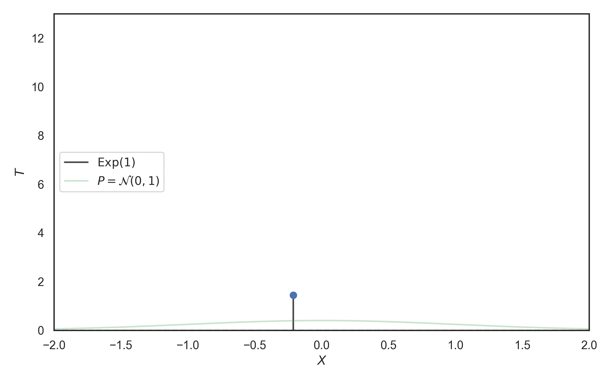
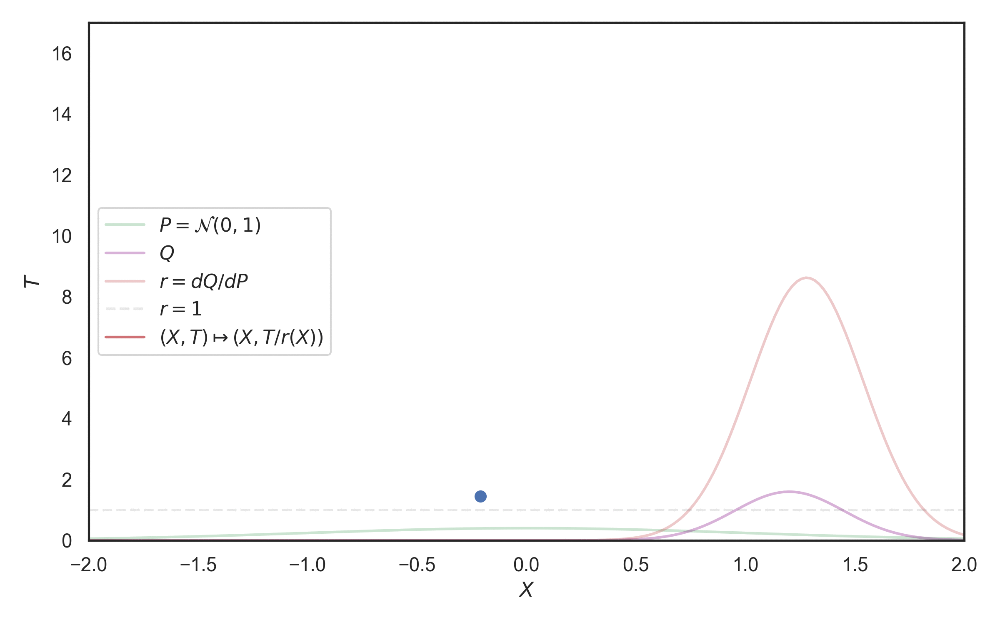
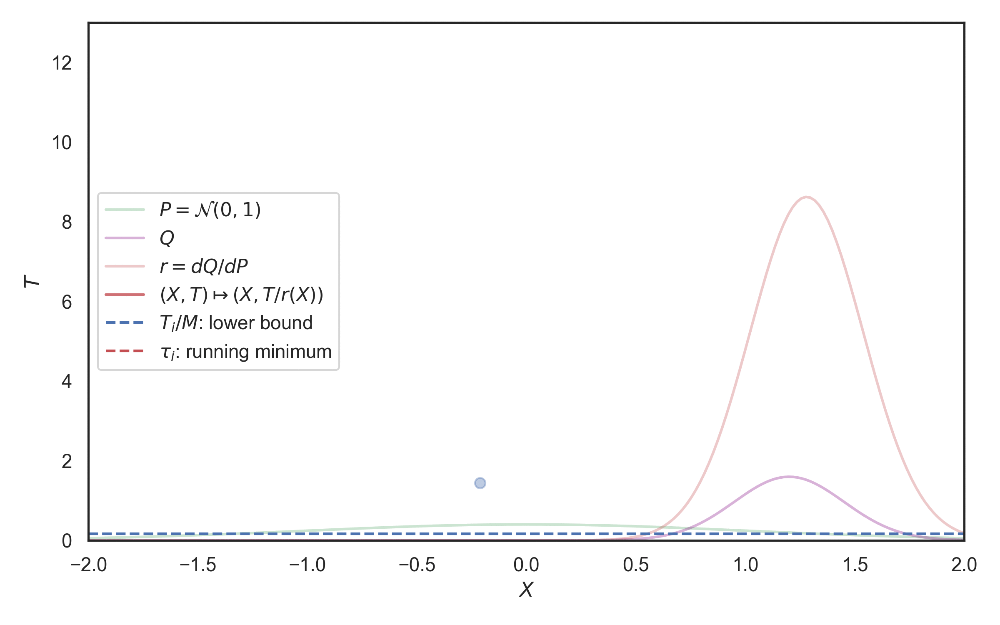
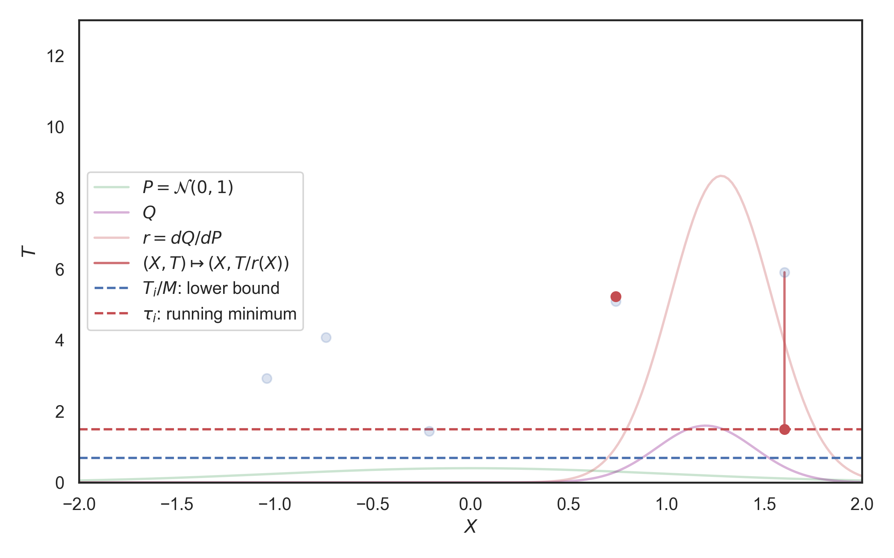

#+TITLE: Sampling as search
#+author: Gergely Flamich
#+date: 25/02/2026

#+REVEAL_ROOT: https://cdn.jsdelivr.net/npm/reveal.js
# This is needed to make the speaker notes work
#+REVEAL_REVEAL_JS_VERSION: 4
#+OPTIONS: reveal_title_slide:"<h2>%t</h2><h2>%s</h2> <h4>%a</h4><h4>%d</h4><h6>gergely-flamich.github.io</h6>"
#+OPTIONS: toc:nil
#+OPTIONS: num:nil
#+REVEAL_THEME: white
#+REVEAL_INIT_OPTIONS: slideNumber:'c/t', transition:'none'
#+REVEAL_HLEVEL:0
#+REVEAL_MATHJAX_URL: https://cdn.jsdelivr.net/npm/mathjax@3/es5/tex-mml-chtml.js
#+REVEAL_EXTRA_CSS: ./presentation_styles.css

* random variate simulation

#+ATTR_REVEAL: :frag (appear)
 - target distribution $Q$
 - want to simulate $X \sim Q$
 - *BUT* what does "simulate" really mean?
 - depends on computational framework

* inverse transform sampling
#+ATTR_REVEAL: :frag (appear)
Let $X \in \mathbb{R}$ with CDF $F$.
Then, $F(X) \sim ?$
#+ATTR_REVEAL: :frag (appear)
$$
\mathbb{P}[F(X) \leq u] = \mathbb{P}[X \leq F^{-1}(u)] = F(F^{-1}(u)) = u
$$
#+ATTR_REVEAL: :frag (appear)
$F(X) = U \sim \mathrm{Unif}(0, 1)$, hence $F^{-1}(U) \sim X$
#+ATTR_REVEAL: :frag (appear)
*Assumption:* can simulate from $\mathrm{Unif}(0, 1)$

* rejection sampling
#+ATTR_REVEAL: :frag (appear)
Let $X \in \Omega, Q \ll P$ and $r = dQ/dP$ with $r < M$

#+ATTR_REVEAL: :frag (appear)
For $i = 1, 2, \dots$ let $X_i \sim P$ and $U_i \sim \mathrm{Unif}(0, 1)$

#+ATTR_REVEAL: :frag (appear)
$$
K = \min\{k \in \mathbb{N} \mid U_i \leq r(X_i) / M \}
$$

#+ATTR_REVEAL: :frag (appear)
Then, $X_K \sim Q$

#+ATTR_REVEAL: :frag (appear)
*Assumption:* can simulate from $P$ and $\mathrm{Unif}(0, 1)$

* how hard is sampling?
#+ATTR_REVEAL: :frag (appear)
*Hard.*
#+ATTR_REVEAL: :frag (appear)
(in general)
#+ATTR_REVEAL: :frag (appear)
Example: $X_i \sim P$ and need to pick one of them

#+ATTR_REVEAL: :frag (appear)
Average sample complexity $\mathbb{E}[K]$ is at least $\Vert r \Vert_\infty$

#+ATTR_REVEAL: :frag (appear)
*In what settings can we do better?*

* poisson processes
#+ATTR_REVEAL: :frag (appear)
 - Collection of random points in space
 - Focus on processes over $\mathbb{R}^D \times \mathbb{R}^+$
 - Exponential inter-arrival times
 - Spatial distribution $P$
 - Mean measure: $P \times \lambda$

* Example with $P = \mathcal{N}(0, 1)$

* a* sampling
#+ATTR_REVEAL: :frag (appear)
*Idea:* Start with a $P \times \lambda$ process and "turn it" into a $Q \times \lambda$ process!

#+ATTR_REVEAL: :frag (appear)
$\Pi = \{(X_i, T_i)\}$ be a $P \times \lambda$ process.

#+ATTR_REVEAL: :frag (appear)
$g(x, t) = (x, t / r(x))$ where $r = dQ/dP$

#+ATTR_REVEAL: :frag (appear)
*Mapping theorem:* $g(\Pi)$ is a $Q \times \lambda$ process.

* a* sampling visually

* basic a* sampling as search
#+ATTR_REVEAL: :frag (appear)
First arrival of the mapped process:
$$
K = \mathrm{argmin}_{k \in \mathbb{N}}\left\{\frac{T_k}{r(X_k)}\right\}
$$

#+ATTR_REVEAL: :frag (appear)
$X_K \sim Q$

* implementing a* sampling
#+ATTR_REVEAL: :frag (appear)
To find it:
$$
\tau_k = \mathrm{min}_{i \in [1:k]}\left\{\frac{T_i}{r(X_i)}\right\}
$$
#+ATTR_REVEAL: :frag (appear)
For $r < M$:
$$
\frac{T_K}{r(X_K)} \geq \frac{T_K}{M}
$$

* basic a* sampling visually

* advanced sampling as search: idea

* advanced sampling as search
#+ATTR_REVEAL: :frag (appear)
Superlevel set
$$
S_r(h) = \{x \in \Omega \mid r(x) \geq h\}
$$

#+ATTR_REVEAL: :frag (appear)
Best restriction: $X_{i + 1} \in S_r(T_i / \tau_i)$

#+ATTR_REVEAL: :frag (appear)
Might be easier to use some *bounding sets* $B_{i + 1} \supseteq S_r(T_i / \tau_i)$
